# The Interpretability of BART (Bayesian Additive Regression Trees)

# Abstract
Bayesian Additive Regression Trees (BART) is an ensemble Bayesian sum-of-trees model and has shown its promising applicability on either simulated data or real data sets. However, it suffers the same issue as most machine learning models -- interpretability -- many of the machine learning models are still a black-box without an intuitive explanation to the general public. While this is the case, BART has been applied to econometrics and causal inference for years. In these domains, explaining and understanding the effect is far more important than making predictions, interpretability is, therefore, an issue that awaits a resolution. In this project, I explore and present different methods and use a simulation approach to analyze how does the BART work and try to understand its interpretability. The result shows, though BART fits data with different underlying models reasonably well, it cannot provide effect size and feature importance in a consistent way in terms of quantitative measures. Further examination may be needed on this topic.


Please see PDF for well-formatted version and Rmd for code.

# Introduction

## Difference between econometrics and machine learning
The essential goal between econometrics methodologies and machine learning models made them different in nature and have different applicability in different fields; econometrics is aim to explain and quantify economics phenomenon while machine learning models aim to make predictions. In recent years, machine learning models have achieved a huge success in a lot of domain since its ability to make predictions are amazing. However, most of them also have an obvious drawback that they are black-boxes, i.e., they are very hard to interpret.

On the other hand, BART is an ensemble method of regression trees, trees itself, are easy to interpret since trees are essentially rules. Additionally, Bayesian methods are conceptually intuitive because it reflects the nature of people observing data and constructing models. These two components combined made BART potentially be an interpretable model. Moreover, BART has its posterior distribution accessible after fitting so methods from probability theories could also be applied. 

Indeed, BART has been applied to econometrics (e.g., Kindo et al., 2013; George et al., 2019) and causal inference (e.g., Hill, 2011; Green & Kern, 2010)sometimes. However, to my knowledge, I haven't seen any discussion on this topic. As it is important to interpret the model used in econometrics instead of making predictions, I believe the interpretability of BART is potentially crucial that should be discussed. Therefore, I wish to explore the methods of qualitatively and quantitatively discuss the interpretability of BART and test it by myself in this project. 

## Interpretability
### What is interpretability
As discussed in Bibal & Frenay (2016), the interpretability of a model should not be linked to the understandability of the learning process generating this model. Efficiency, in other words, concerns the time available to the user to grasp the model. Without this criterion, it could be argued that any model could be understood given an infinite amount of time. Feng and Michie (1994) and others add "mental fit" to the term interpretability and comprehensibility. Whereas "data fit" corresponds to predictive accuracy.

### Why do we need interpretability
Human is those who code, deploy and maintain the models, we want to be able to trust the model, this is the first intuitive answer to this question. Secondly, with interpretability, it will be easier for us to further improve the model, either by feature engineering, parameter tuning or even replace the entire model. Moreover, in the real world, giving prediction along with reasons sometimes make it more convincing. This is crucial in some application scenarios, for example, in recommendation systems, giving a recommendation along with "you may like this product because you bought A, B, and C" make it more convincing. In some domains, exact explanations may be required (e.g. for legal or ethical reasons), and using a black-box may be unacceptable (or even illegal).

### How do we interpret machine learning models
Some models are known to be already interpretable, e.g., decision trees, rules, additive models, attention-based networks, or sparse linear models. While many other models are still black-boxes.

People have been discussed how to measure or quantify interpretability. One most naive method is simply model evaluation. Given good metrics exist, a model can be defined as more interpretable if it has better performance (accuracy, for example). 

Feature importance is another aspect that we want to have some understanding of how do each feature contributes to the model. Either by understanding its rules or simply calculate its importance. In linear models, this can be achieved easily by accessing the coefficient, but in other models, this is a harder task. Sometimes people use permutation methods toward this problem.

There are some other methods that are less widely used but worth to be mentioned here. Learning an interpretable model on the predictions of the black-box model (Craven & Shavlik, 1996; Baehrens et al., 2010), perturbing inputs and seeing how the black box model reacts (Strumbelj & Kononenko, 2010; Krause et al., 2016), or both (Ribeiro et al., 2016).

For deep learning models, there are also probing methods that trained a projection space to project the parameters (weight matrices, for example) to understandable spaces. Also, some visualization techniques may have already been widely used. In addition, researchers from other fields also tried to apply tasks or metrics from other disciplines to see the correlation and connection between them. For example, between EEG data from brain and NLP models for linguistics features or between quantities in philosophy and psychology theories and pre-trained word embeddings.

### The trade-off
In real-world applications, we often met a trade-off between interpretability and predictability. For instance, a simple linear model provides an extremely interpretable model but often lack of accuracy on complex problems.

In econometrics, people often care more about a single measure such as effect size or causal effect; in this context, researchers are trying to construct economic theories instead of making predictions. Thus, a simpler interpretable model is often chosen. In business applications, however, people often care more about prediction since forecasting is crucial in making profits.

Since BART has already shown its predictability that it outperforms 4 common algorithms on 42 different datasets (Chipman et al., 2010), it is worthy to explore the interpretability of it.

# Overview of BART
This section is a quick overview of BART by dumping formulas. More detailed explanations can be found in Hill (2011), Hahn (2020), Chipman et al. (2010), Tan & Roy (2019), and Kapelner & Bleich (2013).

## Structure
BART is a sum-of-trees ensemble with an estimation approach relying on a fully Bayesian probability model.

$$\boldsymbol{Y}=f(\boldsymbol{X})+\mathcal{E} \approx \sum_i^m\mathcal{T}_{i}^{\mathcal{M}}(\boldsymbol{X})+\mathcal{E}, \quad \mathcal{E} \sim \mathcal{N}_{n}\left(\mathbf{0}, \sigma^{2} \boldsymbol{I}_{n}\right)$$
where $\boldsymbol{Y}$ is the responses, $\boldsymbol{X}$ is the covariates and $\mathcal{E}$ is the noise. Here we have $m$ distinct regression trees, each composed of a tree structure, denoted by $\mathcal{T}$, and the parameters at the terminal nodes (also called leaves), denoted by $\mathcal{M}$. 

The prior for the BART model has three components: (1) the tree structure itself, (2) the leaf parameters given the tree structure, and (3) the error variance $\sigma^2$ which is independent of the tree structure and leaf parameters 
$$
\begin{aligned}
\mathbb{P}\left(T_{1}^{\mathcal{M}}, \ldots, \mathcal{T}_{m}^{M}, \sigma^{2}\right) &=\left[\prod_{t} \mathbb{P}\left(\mathcal{T}_{t}^{\mathcal{M}}\right)\right] \mathbb{P}\left(\sigma^{2}\right) \\
&=\left[\prod_{t} \mathbb{P}\left(\mathcal{M}_{t} | \mathcal{T}_{t}\right) \mathbb{P}\left(\mathcal{T}_{t}\right)\right] \mathbb{P}\left(\sigma^{2}\right) \\
&=\left[\prod_{t} \prod_{\ell} \mathbb{P}\left(\mu_{t, e} | \mathcal{T}_{t}\right) \mathbb{P}\left(\mathcal{T}_{t}\right)\right] \mathbb{P}\left(\sigma^{2}\right)
\end{aligned}
$$

This prior structure enables BART to enforce shallow tree structures, limiting the complexity of a single tree, thus regularize the model.

At depth $d$, the prior probability is set to be
$$\alpha(1+d)^{-\beta}$$
where $\alpha \in(0,1)$ and $\beta \in[0, \infty]$.

The posterior distribution is obtained using a Metropolis-within-Gibbs sampler (Geman & Geman, 1984; Hastings, 1970). The sampler for BART uses a form of “Bayesian backitting” (Hastie & Tibshirani 2000) where the jth tree is fit iteratively, holding all other m-1 trees constant by exposing only the residual response.

## Assumptions
As above equations, BART requires mean-centered noises $\epsilon$ and it should be normally distributed. It can be tested using the normality and the heteroskedasticity test. A function `check_bart_error_assumptions` in `bartMachine` can test this assumption.

Also, BART requires convergence of its Gibbs sampler, which can be tested using `plot_convergence_diagnostics`.

## Comparisons
One of the unique features of BART is that it is based on a fully Bayesian model so we have access to the full posterior. As a result, we can have things like credible intervals. Also, it could be applied to classification since it can model probabilistic uncertainty naturally.

The downside of that is, when the number of variables is large, BART will have a high rejection rate when proposing the splitting rules. Also, it is memory intensive for the same reason.

# Simulations, Methods, and Results
In this section, I present several ways of assessing the interpretability of a model. None of them are sufficient to make a conclusion and require more deliberately examination 

I will use simulated data since to be certain about the nature of the data is necessary here in order to understand its interpretability. Though there's definitely gaps between simulated data and real data sets, a simpler and cleaner exploration is the main goal here. The package I will play with is `bartMachine`, it is superior to the original `BayesTree` as it has `predict` function and is faster in speed.

## Posterior distribution
Since BART has a unique property that has posterior distribution available. I first want to compare the "goodness-of-fit" of BART by plotting it and comparing to the original data. After fitting a BART to the simulated data, I sample from the posterior distribution, noted different from the concept of "final posterior", it keeps all posterior in each iteration after burn-in.

The following plots compare the simulated data using the same $X$ with different functions. The black line is the distribution of the response $y$ and each colored line is a fitted posterior distribution for five independent runs.

The functions are intuitive by its name, for example, addition is,
$$Y = X_1 + X_2 + X_3 + X_4 + X_5 + \epsilon, \quad \epsilon \sim \mathcal{N}(0, 1)$$

and interaction/multiplication is,
$$Y = X_1 + X_2 + X_1*X_2 + X_3 + X_4 + X_5 + \epsilon, \quad \epsilon \sim \mathcal{N}(0, 1)$$

See code for all specifications.

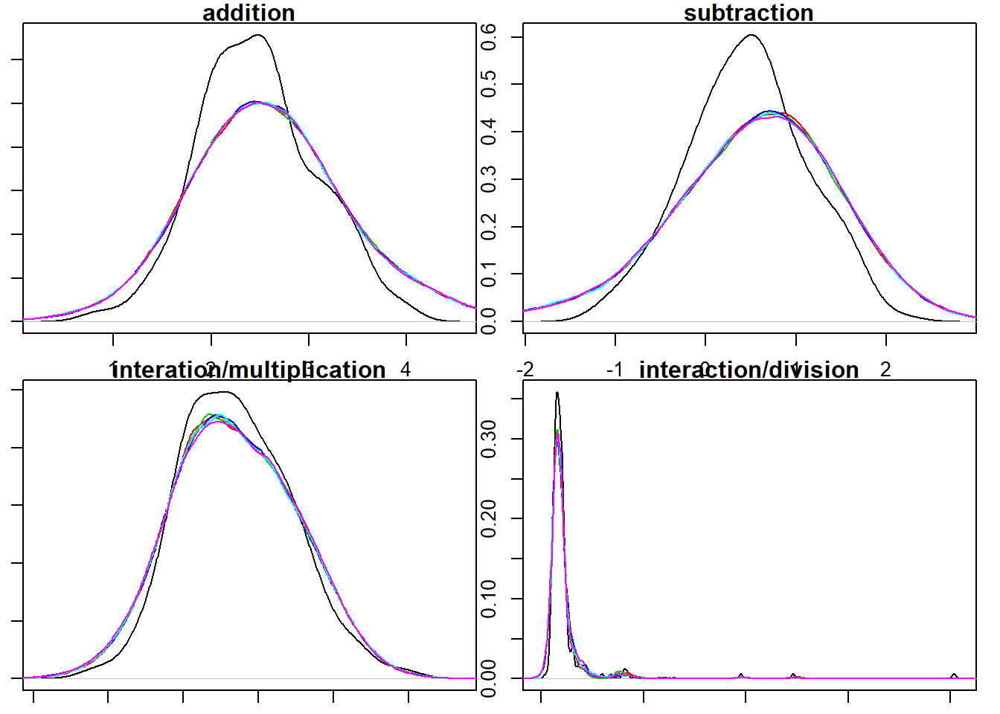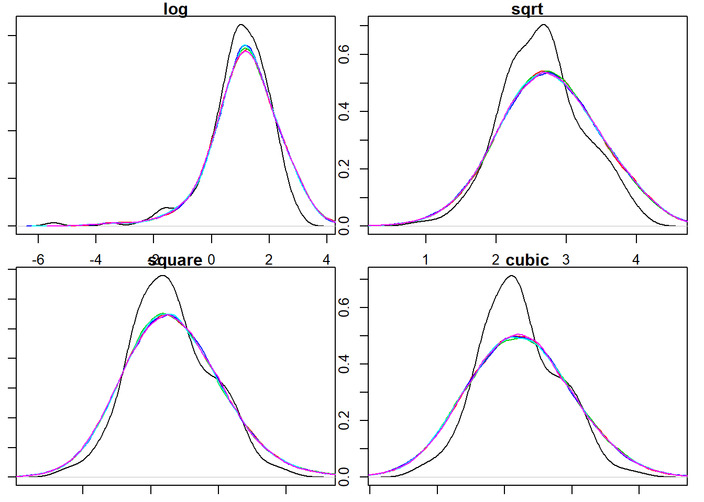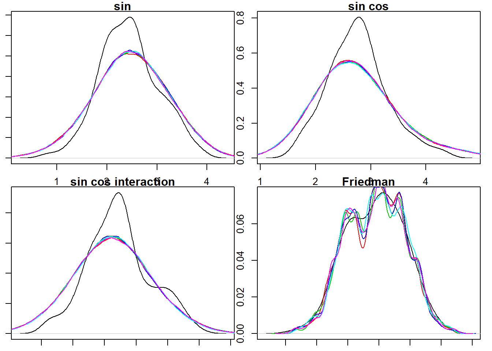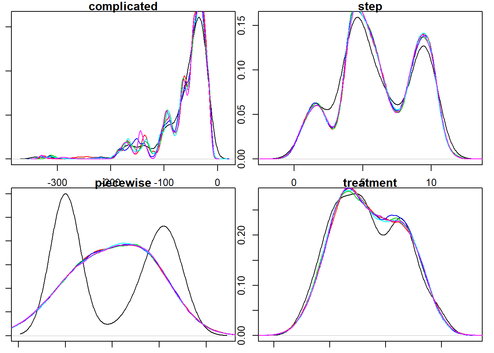

From the above plots, it seems BART doesn't fit the best for simple models but fits very well for complicated models. It doesn't matter if the model itself is linear or nonlinear, stepwise or not due to the nature of BART is regression trees.

On the other hand, we can see the prior plays a role in posterior distribution by regularizing the shape. Since BART favors shallow trees by incorporating the prior, each tree is a weak learner. With the integration of weak learners, it can't be too different from adding tons of normal distribution together due to the central limit theorem. This property can be seen in the fitted posterior that they all look like bell curves adding together with different resolutions.

Piecewise function, however, seems is the weakness of BART. The piecewise and the treatment simulate the discontinuity in some experimental design settings. For example, in regression discontinuity design (RDD), we may encounter the exact same model.

In addition, the Friedman function,
$$Y = 10  \sin(\pi X_1  X_2) +20  (X_3 -0.5)^2 + 10  X_4 + 5  X_5 + \epsilon, \quad \epsilon \sim \mathcal{N}(0, 1)$$
serves as a standard for evaluating approximation. It can also be found the BART fit reasonably well but with some obvious deviation.

Since BART provides access to the posterior distribution, credible intervals instead of confidence intervals are available. Though linear models have point estimates and confidence intervals, this feature hear is critical compared to other machine learning models.

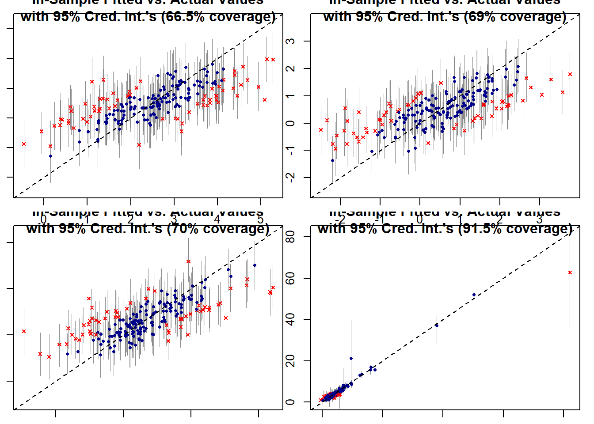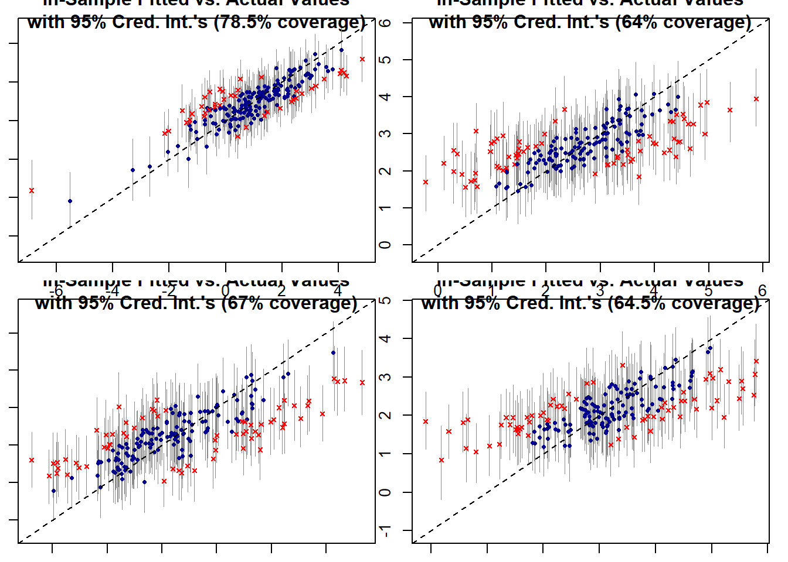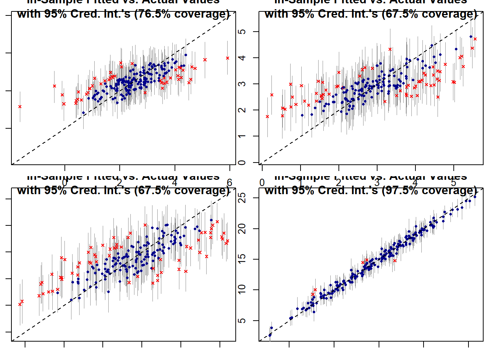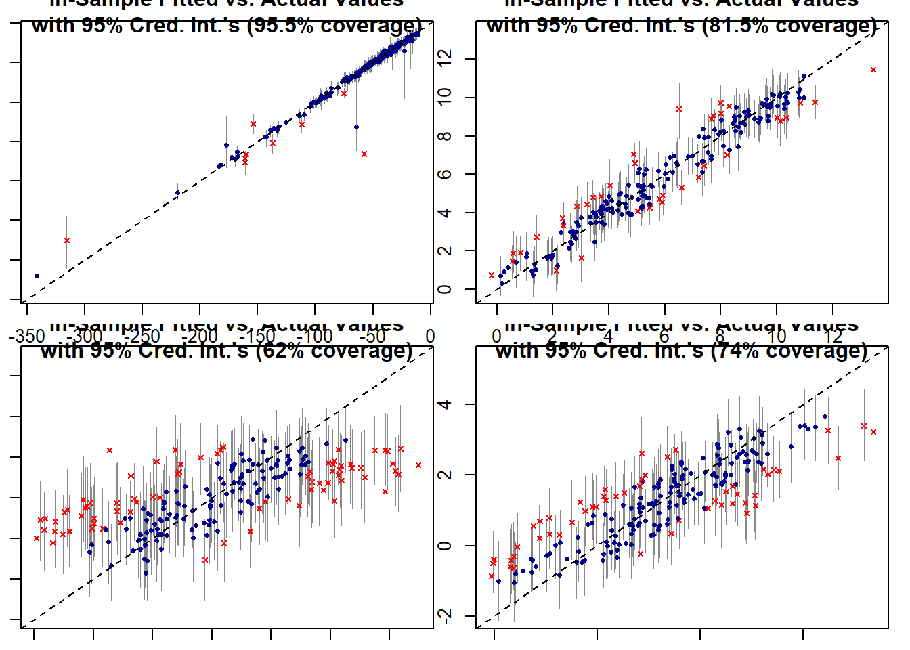

In summary, these density plots and deviation plots show BART has a reasonable fit for most of the models, though not perfectly ideal. With the posterior distribution, we can do a lot more with them such as drawing samples from it for further inference. However, the usage of this approach should be more closely examined since the posterior is not always satisfying.

## Perturbation
In this section, I apply a small perturbation to test how BART responses to make predictions. Specifically speaking, after the training phase, I input new data to make a prediction, the new data is the mean of all columns but with a small perturbation on one of the column.


Firstly, I use the linear model (`model1`)
$$Y = X_1 + X_2 + X_3 + X_4 + X_5 + \epsilon, \quad \epsilon \sim \mathcal{N}(0, 0.1)$$
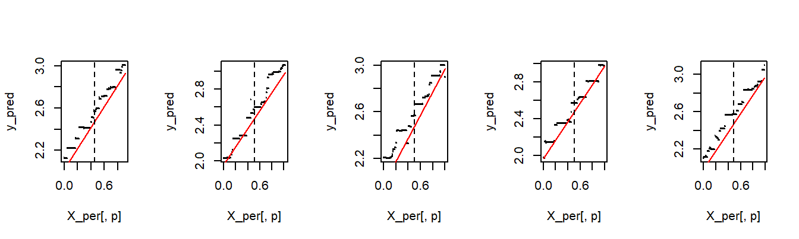

The plots above from left to right are perturbation on five columns; the red lines are the true $y$ while black dots are predicted $y$. They show the model capture the relationship between $X$ and $y$ pretty well. We can also see the shadow of trees from it that there are obvious discontinuities. 

However, if I use the model (`model2`)
$$Y = 100X_1 + 10X_2 + 5X_3 + 2X_4 + X_5 + \epsilon, \quad \epsilon \sim \mathcal{N}(0, 0.1)$$
I found it captures the first covariate almost perfectly while less and less for the other covariates. Noted the number of parameters here is always the same. Apparently, it puts all its effort to capture the most influential one.

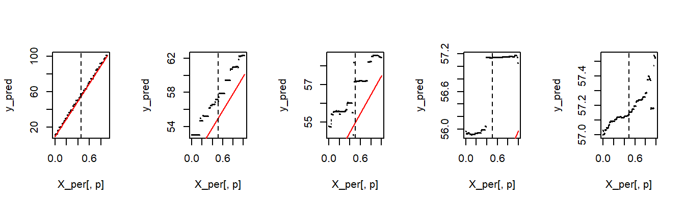

I then apply the Friedman function,
$$Y = 10  \sin(\pi X_1  X_2) +20  (X_3 -0.5)^2 + 10  X_4 + 5  X_5 + \epsilon, \quad \epsilon \sim \mathcal{N}(0, 1)$$
And found it fits the true $y$ very well.

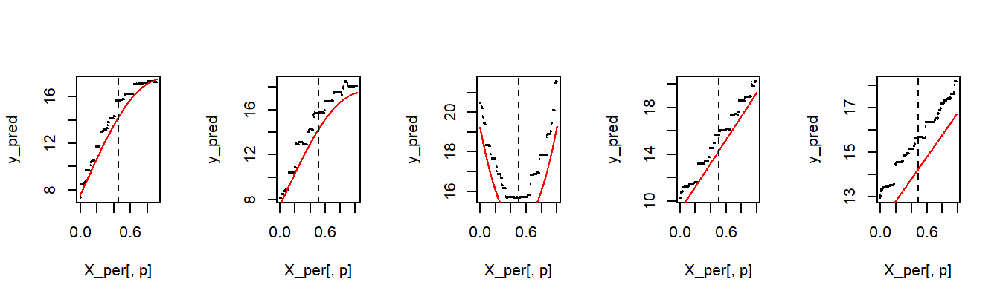

Same deviation happens when I multiply the first coefficient 100 times larger.
$$Y = 1000  \sin(\pi X_1  X_2) +20  (X_3 -0.5)^2 + 10  X_4 + 5  X_5 + \epsilon, \quad \epsilon \sim \mathcal{N}(0, 1)$$

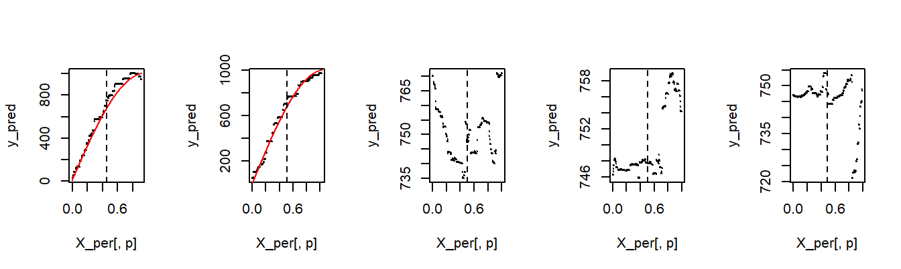

These experiments show BART fit the data pretty well on each covariate given the "effect size" of them is similar. This is something we should be noticed when we want to interpret the model. As a comparison, a simple regression doesn't have this phenomenon for linear relations.


```
##        (Intercept) X[, 1] X[, 2] X[, 3] X[, 4] X[, 5]
## model1       -0.02   1.01   1.01   1.01   1.03   1.00
## model2       -0.01 100.00  10.00   5.01   2.04   0.98
```

## Partial dependence
Partial dependence function (PDP) developed by Friedman (2001) that is conceptually similar to perturbation above. The partial dependence of a predictor is the average value of $f$ when other covariates vary over its marginal distribution.
$$f_{j}\left(\boldsymbol{x}_{j}\right)=\mathbb{E}_{\boldsymbol{x}_{-j}}\left[f\left(\boldsymbol{x}_{j}, \boldsymbol{x}_{-j}\right)\right]:=\int f\left(\boldsymbol{x}_{j}, \boldsymbol{x}_{-j}\right) \mathrm{dP}\left(\boldsymbol{x}_{-j}\right)$$
and can be estimated by
$$\hat{f}_{j}\left(\boldsymbol{x}_{j}\right)=\frac{1}{n} \sum_{i=1}^{n} \hat{f}\left(\boldsymbol{x}_{j}, \boldsymbol{x}_{-j, i}\right)$$
As BART has the posterior distribution, we can plot credible intervals for the PDP. See Friedman (2001) and Kapelner & Bleich (2013) for more details.

I use the function `pd_plot` in `bartMachine` plotted below and the result is similar to the above analysis.


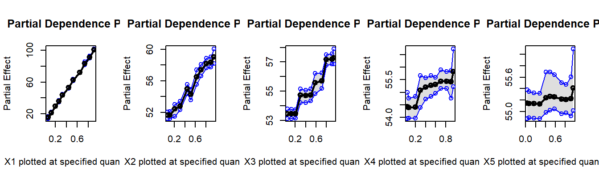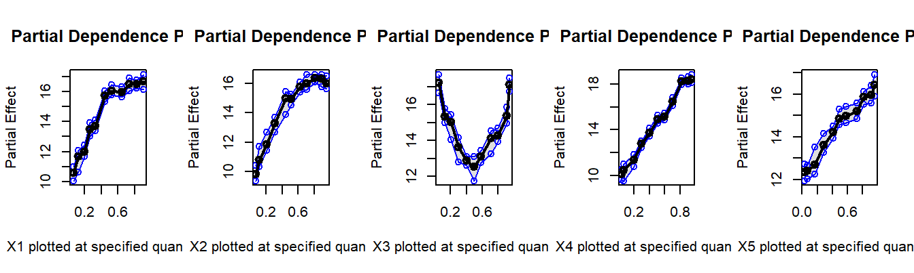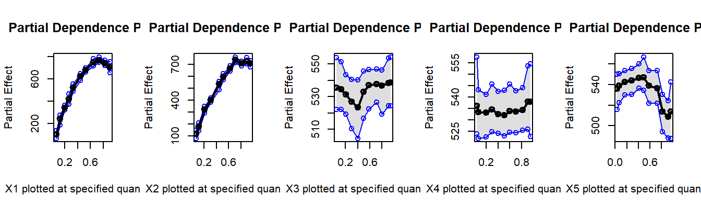

## Feature importance
Another important aspect to explain the model is whether we can tell the importance of each feature and quantify that measure. Similar to the linear model example above, the coefficients in linear regression directly indicate its effect size of covariates on the response. Many machine learning lack this property, as well as BART. People have come up with ways to measure feature importance in indirect approaches, feature permutation is one of them.

### Feature permutation
Feature permutation shuffles or resample the entire column (covariates) and fit the model again. The accuracy or RMSE is expected to decrease if this feature is meaningful. So we can measure the decrease in terms of RMSE as a measure of feature importance. I apply 5-fold cross-validation for all the metrics.

The plots below show the feature importance calculated using this method for `model1` and `model2`. The red dots are the original result without perturbation. The difference is printed below indicating its importance.

As we can see, for `model1`, this measure is quite accurate. The estimated number, 0.770, for example, is not so far from 1; and 128.305 is not so far from 100.


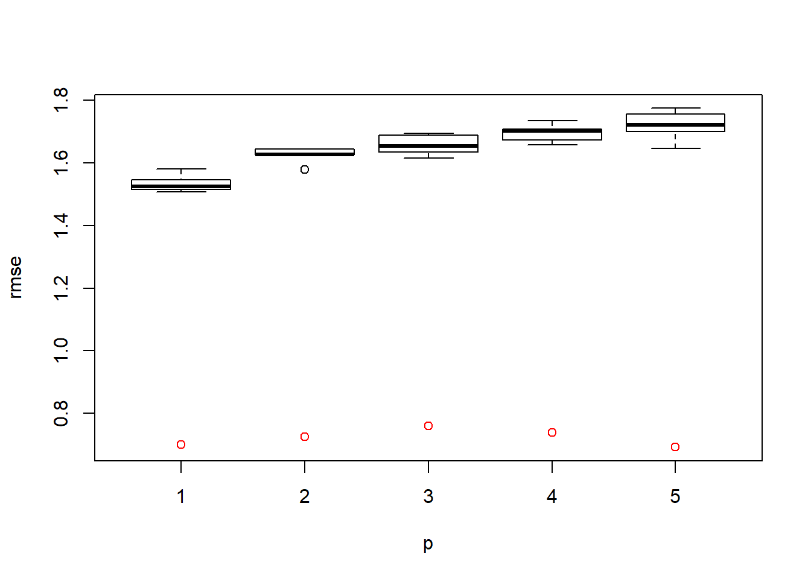

```
## [1] 0.842 0.884 0.885 0.923 1.016
```

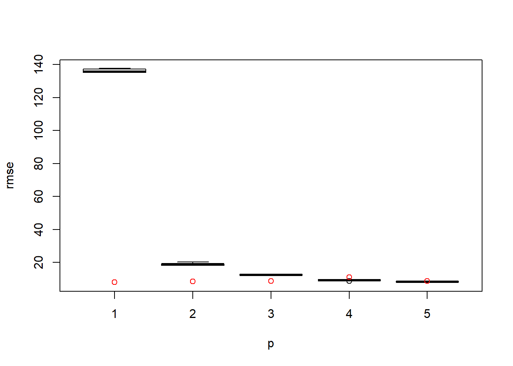

```
## [1] 128.64279   9.02780   3.55092  -0.00895   1.09847
```

### Inclusion proportion
Another two ways to measure the importance of decision trees is to calculate the "inclusion proportions" in the $m$ trees in the iterations after burn-in (Chipman et al. 2010). The inclusion proportion for a covariate is the proportion of times that variable is chosen as a splitting rule, divided by all rules among the posterior draws of the sum-of-trees model (the middle plot below). We can also calculate the proportion it appears in trees (the third plot). The `martMachine` package has a function `investigate_var_importance` to return a feature importance plot.

Comparing this method to coefficients in an ordinary linear regression (the first plot), we have the following plots. Apparently, it captures the relative importance but cannot quantify them very accurately. However, a question is then arose, are coefficients really feature importance? Coefficients are closely related to "effect size" since in linear models, it can be interpreted as "a unit increase in $X_1$ causes $\beta_1$ increases in $y$". There is no such thing in the decision tree. As a result, we need to decide a measure by ourselves in different contexts rather than simply following one universal measure.


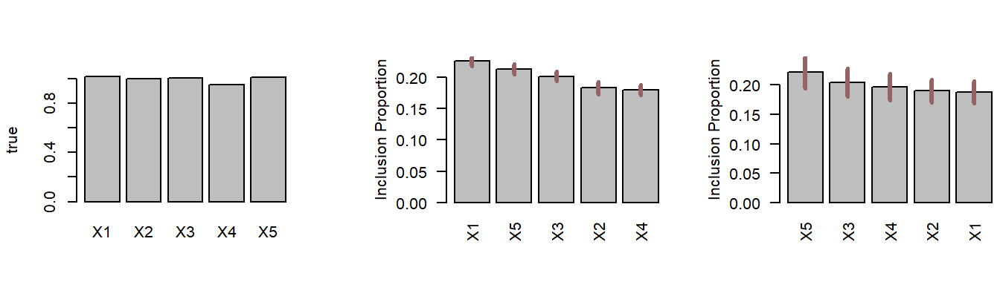

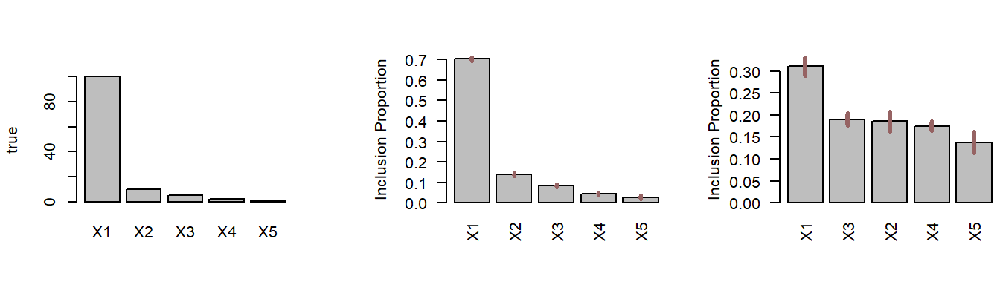

## Fit the fitted
The last method, "fit the fitted" is the opposite of checking the residual. It aims to detect to what extent the information was captured in the model by fitting its prediction $\hat{y}$. In the real world, since we cannot be sure about the nature of the data, it is hard to specify a meaningful model to re-fit the fitted. However, by simulating the data, I will specify a model that is exactly the same as the model generating process to see how much information BART has in the predicted outcome.

The first two results are from `model1` and `model2`, BART captures the coefficients in both models accurately.


```
##            X1    X2   X3   X4   X5
## model1   1.02  1.04 1.00 0.99 0.99
## model2 100.04 10.03 4.98 2.00 1.01
```

The last two results are from linear models with interactions. Similarily, BART captures them very accurately.

$$Y = X_1 + X_2 + X_3 + X_4 + X_5 + 5X_1 X_2+ \epsilon, \quad \epsilon \sim \mathcal{N}(0, 0.1)$$
$$Y = 100X_1 + 10X_2 + 5X_3 + 2X_4 + X_5 + 5X_1 X_2+ \epsilon, \quad \epsilon \sim \mathcal{N}(0, 0.1)$$


```
##            X1   X2   X3   X4   X5 X1X2
## model5   1.08 1.09 1.02 1.03 1.03 4.83
## model6  99.99 9.96 5.01 2.03 1.02 5.03
```

<!-- ## Sensitivity analysis -->

# Conclusion and Discussion
Though there's no universal consensus on how to measure interpretability, the methods I present here provides a glance toward it. With these methods and simulations, it seems BART has good interpretability given the model is additive and linear. Using the posterior distribution, BART is good in capturing linear relations and performs approximates well for nonlinear functions, while piecewise function and experimental design data may need further examination. Despite this, there should be a lot more method we can apply, for example, KL divergence for comparing two distributions or bootstrap could potentially be useful for further analysis. 

In perturbation and partial dependence, I find BART performs reasonably well on functions with similar "effect size" (coefficients). It can still capture enough important variables. But from the analysis in feature importance, the effect size for nonlinear models are doubtful. However, there are definitely more sophisticated methods that I didn't include, for example, Kapelner & Bleich (2013) incorporated Pseudo-R^2 that uses permutation approach as well. Other methods could potentially be useful in explaining the effect size but they require more deliberation.

Lastly, the method in fit the fitted is conceptually naive but impossible to execute in real-world methods. From the result above, we can definitely say BART is good at capturing additive linear models and their interactions. However, there are a lot of possible models around that cannot be simulated and tested thoroughly.

In summary, BART is a pretty good machine learning model that has s unique property (i.e., accessibility of posterior). It has great potential that more methods could be developed to either test its interpretability or push its applicability. As in econometrics, interpret BART directly on a real data set will not be an easy task. Nevertheless, it may provide a unique aspect from the perspective of Bayesian and decision trees.

# References
Chipman, Hugh A., Edward I. George, and Robert E. McCulloch. "BART: Bayesian additive regression trees." The Annals of Applied Statistics 4.1 (2010): 266-298.

Feng, C. and D. Michie. Machine learning of rules and trees. Machine Learning, Neural and Statistical Classification. Ellis Horwood, Hemel Hempstead, 1994.

Friedman J (2001). “Greedy Function Approximation: A Gradient Boosting Machine.” The Annals of Statistics, 29(5), 1189–1232. doi:10.1214/aos/1013203451.

Geman S, Geman D (1984). “Stochastic Relaxation, Gibbs Distributions, and the Bayesian Restoration of Images.” IEEE Transaction on Pattern Analysis and Machine Intelligence, 6, 721–741. doi:10.1109/tpami.1984.4767596.

George, Edward, et al. "Fully Nonparametric Bayesian Additive Regression Trees." Topics in Identification, Limited Dependent Variables, Partial Observability, Experimentation, and Flexible Modeling: Part B (Advances in Econometrics 40 (2019): 89-110.

Green, Donald P., and Holger L. Kern. "Modeling heterogeneous treatment effects in large-scale experiments using bayesian additive regression

Hahn, P. Richard, Jared S. Murray, and Carlos M. Carvalho. "Bayesian regression tree models for causal inference: regularization, confounding, and heterogeneous effects." Bayesian Analysis (2020).

Hastie T, Tibshirani R (2000). “Bayesian Backfitting.” Statistical Science, 15(3), 196–213. doi:10.1214/ss/1009212815.

Hastings WK (1970). “Monte Carlo Sampling Methods Using Markov Chains and Their Applications.” Biometrika, 57(1), 97–109. doi:10.2307/2334940.

Hill, Jennifer L. "Bayesian nonparametric modeling for causal inference." Journal of Computational and Graphical Statistics 20.1 (2011): 217-240.

Kapelner, Adam, and Justin Bleich. "bartMachine: Machine learning with Bayesian additive regression trees." arXiv preprint arXiv:1312.2171 (2013).

Kindo, Bereket P., Hao Wang, and Edsel A. Peña. "MPBART-Multinomial Probit Bayesian Additive Regression Trees." arXiv preprint arXiv:1309.7821 (2013).

Rossi, Ryan A., Rong Zhou, and Nesreen K. Ahmed. "Deep inductive network representation learning." Companion Proceedings of the The Web Conference 2018. 2018.

Tan, Yaoyuan Vincent, and Jason Roy. "Bayesian additive regression trees and the General BART model." Statistics in medicine 38.25 (2019): 5048-5069.


